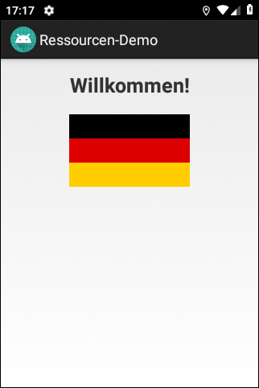
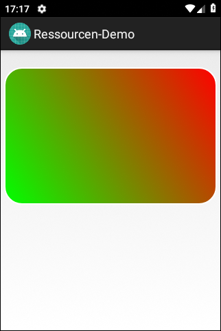
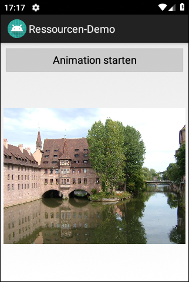
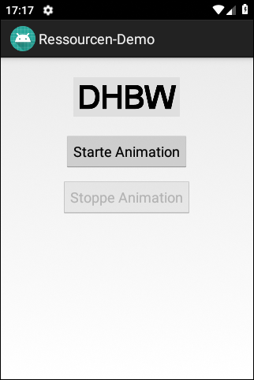

# Android-App "Ressourcen-Demo"

Android app demonstrating the usage of several types of resources.
 

Identifiers (names for classes, variables and methods), (JavaDoc) comments and UI texts are in German only.

 

----
## Screenshots

  

 

 

 

 

 

----
# License

See the [LICENSE file](LICENSE.md) for license rights and limitations (BSD 3-Clause License).
