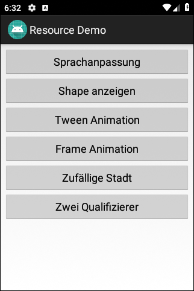

# Android-App "Ressourcen-Demo" #

 

Dieses Repo enthält eine Android-Studio-Projekt für eine native Android-App mit Java,
die die Verwendung verschiedener Typen von Ressourcen demonstriert.

 

----

## Screenshots ##

 

 

 &nbsp; 

 

 &nbsp; 

 

 &nbsp; 

 

----

## License ##

 

See the [LICENSE file](LICENSE.md) for license rights and limitations (BSD 3-Clause License).

 
